<div align="center">
  <a href="https://rustvnt.com"></a>
  <h1><p><em>VNT 一个简便高效的异地组网、内网穿透工具。</em></p></h1>
	<a href="https://github.com/vnt-dev/vnt/releases"></a>
  <a href="https://github.com/vnt-dev/vnt/graphs/contributors"></a>
  <a href="https://github.com/vnt-dev/vnt/releases/"></a>
  <a href="https://github.com/vnt-dev/vnt/issues"></a>
  <a href="https://github.com/vnt-dev/vnt/discussions"></a>
  <a href="GitHub repo size"></a>
  <a href="https://github.com/vnt-dev/vnt/actions?query=workflow%3ABuild"></a>
  <a href="https://hub.docker.com/r/lubeilin/vnt"></a>
</div>


# 群晖 Synology 篇 （以DSM 7.2 为例）

## [部署vnt-cli客户端](https://github.com/lmq8267/vnt/edit/main/docs/Synology.md#%E4%B8%80%E5%89%8D%E6%8F%90%E9%9C%80%E8%A6%81%E5%85%88%E7%A1%AE%E5%AE%9A%E5%B7%B2%E5%8A%A0%E8%BD%BD%E5%A5%BDtun%E6%A8%A1%E5%9D%97%E5%A6%82%E6%9E%9C%E6%B2%A1%E6%9C%89tun%E6%A8%A1%E5%9D%97%E7%9A%84%E5%88%99%E5%8F%AA%E8%83%BD%E4%BD%BF%E7%94%A8vn-link-cli)：
1.[Docker部署](https://github.com/lmq8267/vnt/edit/main/docs/Synology.md#1docker%E8%BF%90%E8%A1%8C%E6%9C%89tun%E6%A8%A1%E5%9D%97%E4%BD%BF%E7%94%A8%E7%89%B9%E6%9D%83%E6%A8%A1%E5%BC%8F)<br>
2.[第三方套件运行](https://github.com/lmq8267/vnt/edit/main/docs/Synology.md#%E7%AC%AC%E4%B8%89%E6%96%B9%E5%A5%97%E4%BB%B6%E8%BF%90%E8%A1%8C)<br>
3.[ssh二进制运行](https://github.com/lmq8267/vnt/edit/main/docs/Synology.md#ssh%E4%BA%8C%E8%BF%9B%E5%88%B6%E8%BF%90%E8%A1%8C)
## [部署vnts服务端]()：

<br>

### 一、前提需要先确定已加载好tun模块，如果没有tun模块的则只能使用vn-link-cli

#### ①启用群晖的ssh功能，打开ssh输入下述命令查看是否已加载好tun模块
```bash
#检查是否安装了 tun 模块：
lsmod | grep tun
#或者
ls /dev/net/tun
```
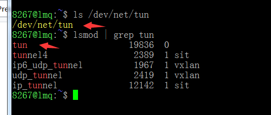
#### ②如上图输出信息则是有tun模块，
#### 如果没有输出，可执行下述命令加载，再使用上述命令检测是否加载成功
```bash
#如果上述结果为空，请尝试加载它：
sudo modprobe tun
#或者
sudo insmod /lib/modules/tun.ko
```
#### ③如果须手动加载tun的还需要设置开机自动加载tun模块，打开群晖的任务计划，
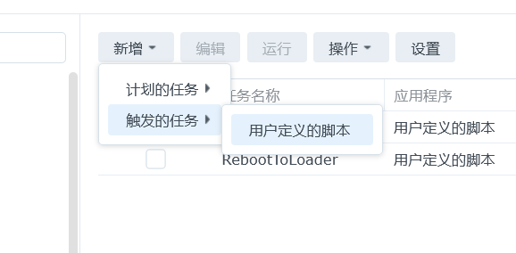
#### 使用root用户添加开机启动命令，
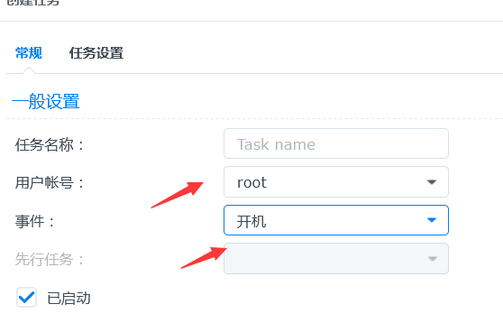
#### 填写开机加载tun的命令，其中的`mypassword`改成你的root密码
```bash
sudo -S ls >/dev/null 2>&1 << EOF
mypassword
EOF
sudo insmod /lib/modules/tun.ko >/dev/null 2>&1 &

```

#### 或参考[解决群晖 NAS 无法使用 TUN / TAP 的问题 ](https://www.moewah.com/archives/2750.html)

### 1.Docker运行（有tun模块，使用特权模式）
#### ①打开群晖管理页面，打开docker套件
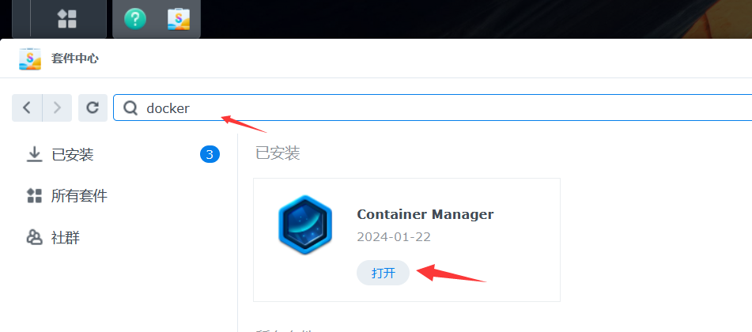
#### ②打开注册表搜索vnt，找到vnt镜像双击拉取，
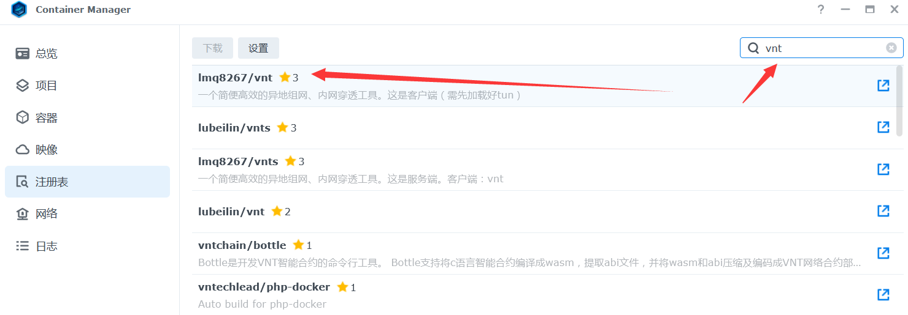
#### 如果拉取失败，点击[离线镜像包](https://github.com/lmq8267/vnt-cli/releases)下载对应平台架构docker的离线镜像包docker.tar上传安装，
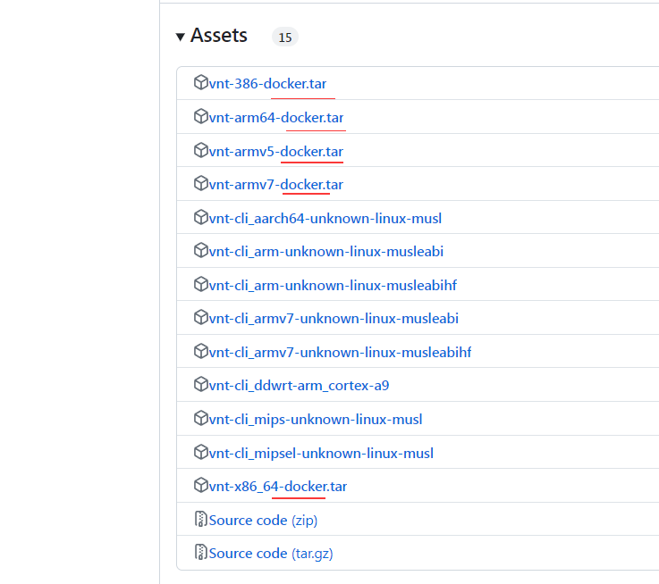
#### 选择刚下载的离线镜像.tar的上传进去
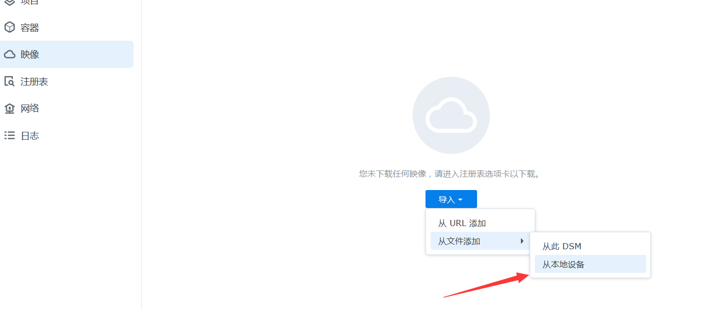
#### ③打开容器，创建一个新的额容器，选择刚刚上传的镜像，
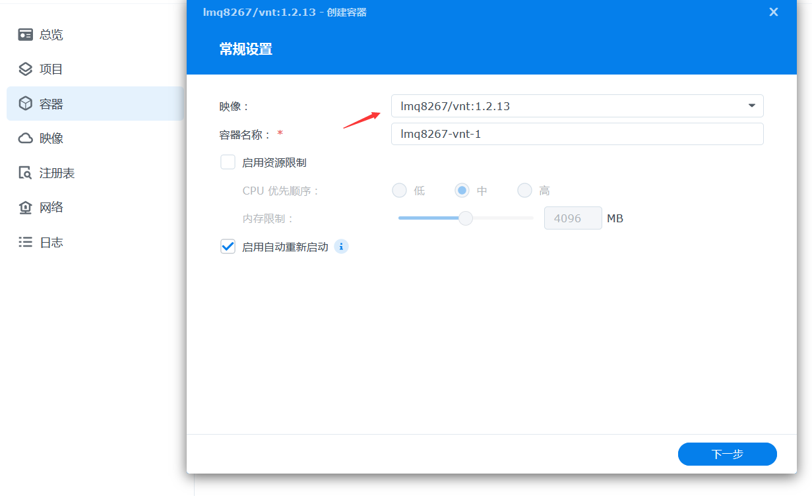
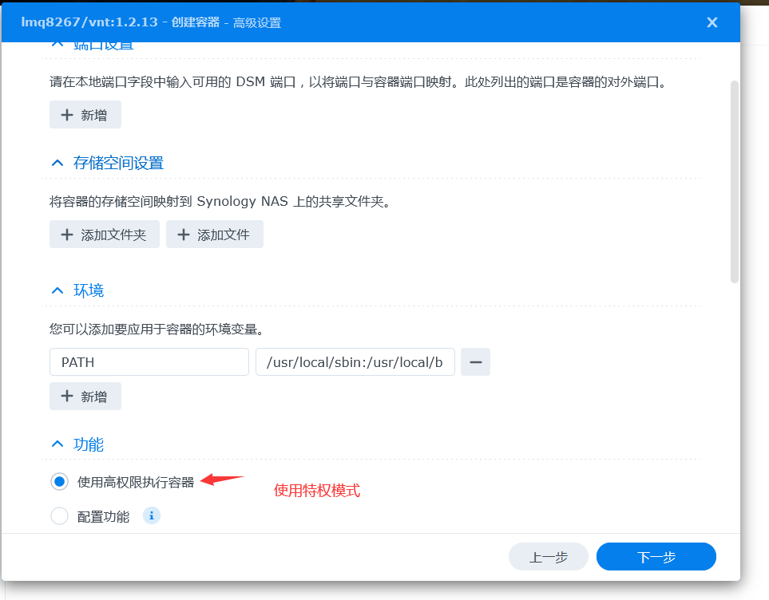

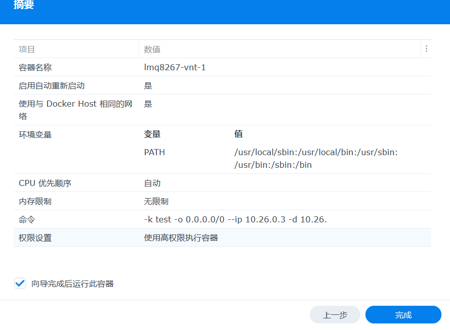
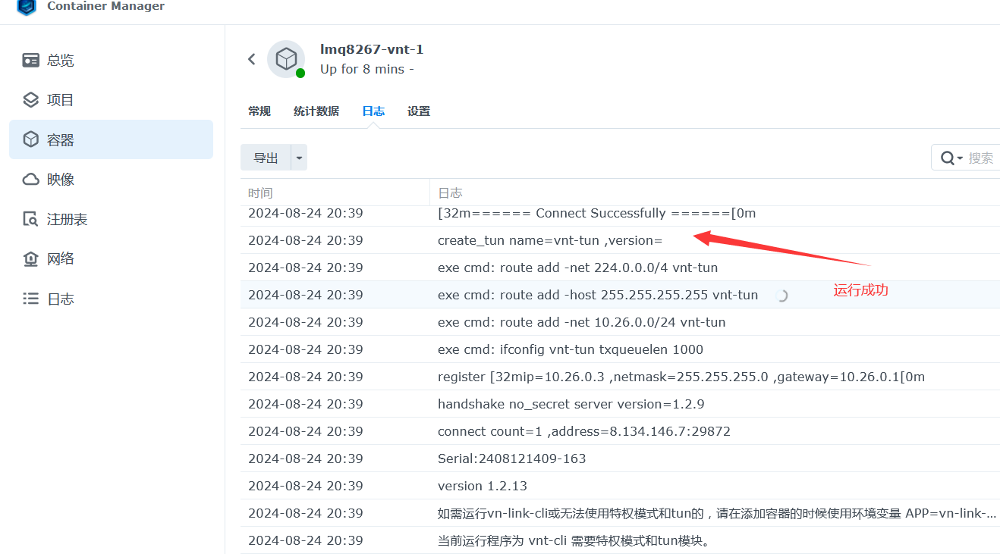
#### 至此docker部署完成，另附docker-compose.yml 参考
```bash
version: '3.9'
services:
    #用于自动更新vnt-cli镜像，若不需要请删除这部分
    watchtower: 
         command: --interval 3600 --cleanup --label-enable
         container_name: watchtower
         environment:
               - TZ=Asia/Shanghai
               - WATCHTOWER_NO_STARTUP_MESSAGE
         image: containrrr/watchtower
         restart: always
         volumes:
               - /var/run/docker.sock:/var/run/docker.sock
   #若不需要请删除这部分
    vnt:
        #vnt-cli的启动命令参数下方修改为你的
        command: '-k test123 --ip 10.26.0.3 -d 10.26.0.3 -o 0.0.0.0/0'
        image: lmq8267/vnt
        restart: always
        privileged: true
        network_mode: host
        container_name: vnt-cli

```

### 2.第三方套件运行
#### ①打开群晖管理界面-套件中心，添加第三方套件源（[我不是矿神](https://imnks.com/)  DSM7 地址：https://spk7.imnks.com），
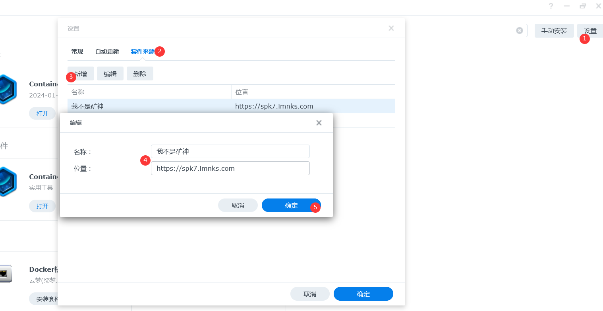
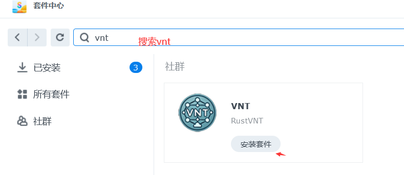
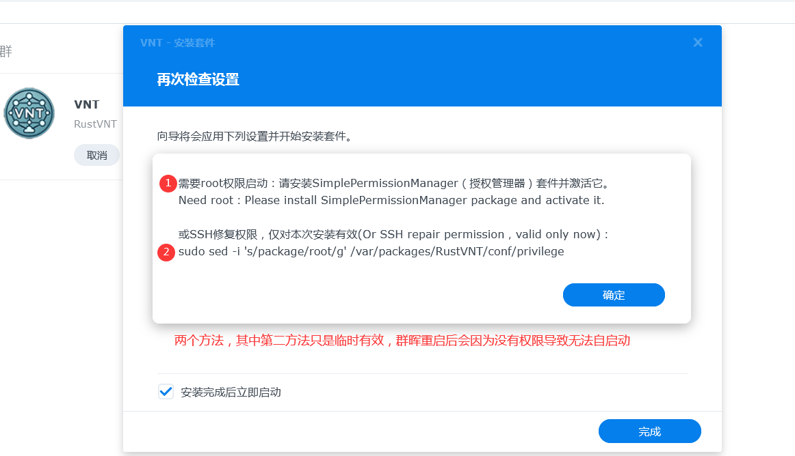
`sudo sed -i 's/package/root/g' /var/packages/RustVNT/conf/privilege`
#### 这里建议使用第一个方法，每次开机自动赋予权限
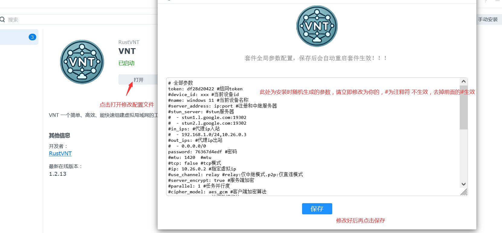
#### [配置文件模板](https://github.com/vnt-dev/vnt/blob/main/vnt-cli/README.md#-f-conf)参考，
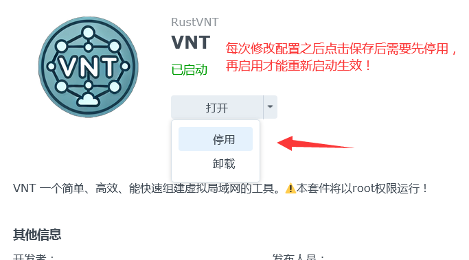
#### 可以打开ssh输入命令来查看启动状态，
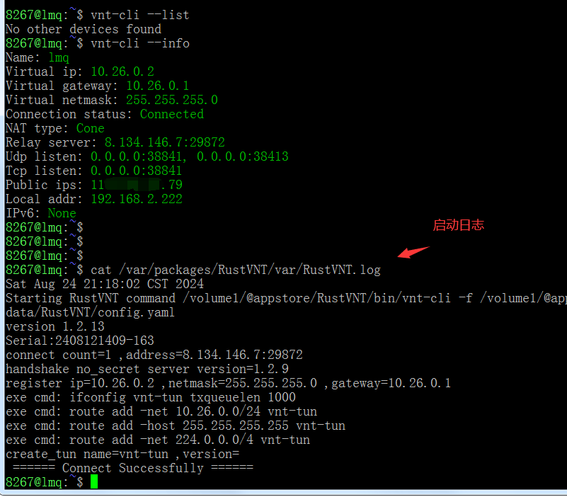
#### 如上表示启动成功，日志路径在`/var/packages/RustVNT/var/RustVNT.log` 配置文件路径在`/var/packages/RustVNT/var/config.yaml` 至此套件部署完成~

### 3.ssh二进制运行
